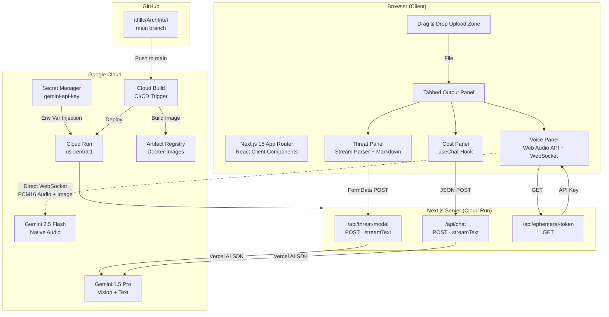
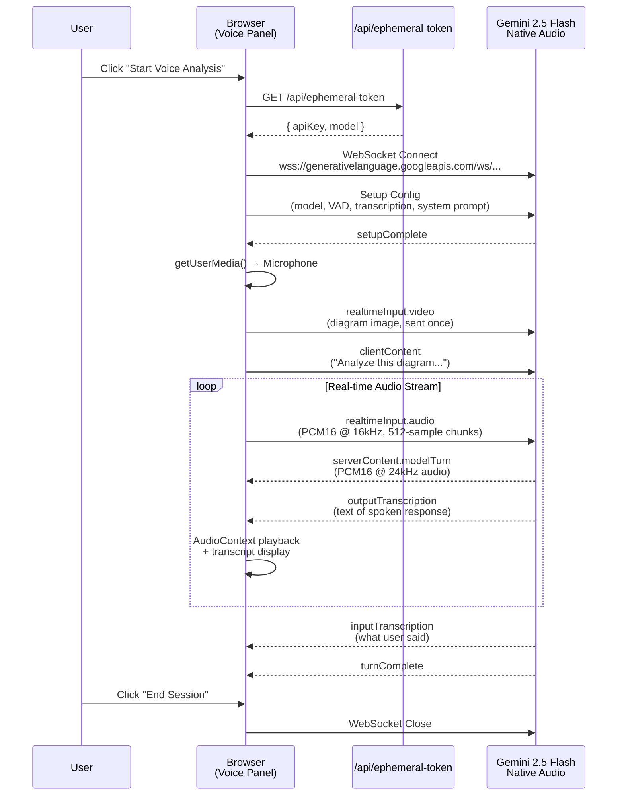
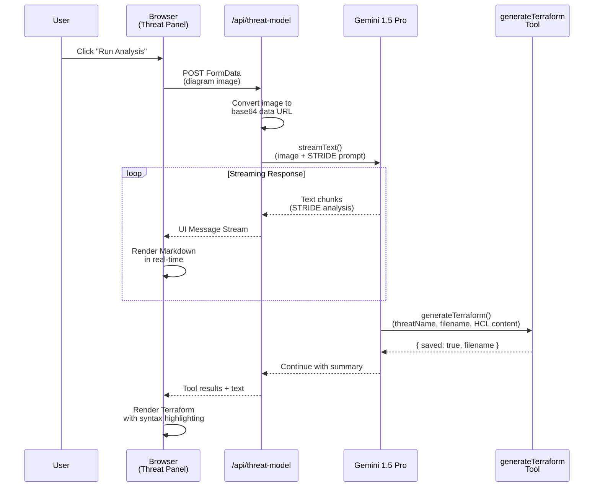
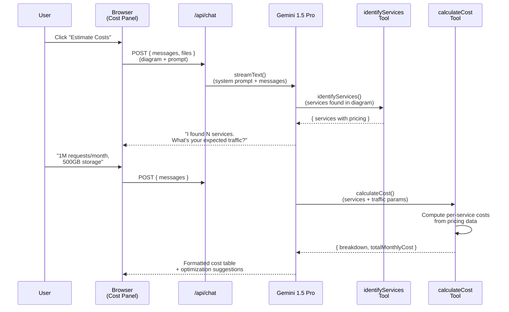
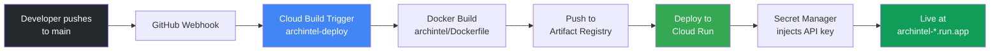

# ArchIntel System Architecture

> **Version:** 1.0
> **Last Updated:** 2026-03-21
> **Status:** Production (Google Cloud Run)

---

## 1. Overview

ArchIntel is an architecture intelligence platform that transforms static architecture diagrams into actionable security, cost, and conversational insights. Users upload a single diagram and receive three dimensions of analysis through a unified dark-mode interface.

**Live URL:** https://archintel-346168839454.us-central1.run.app

---

## 2. High-Level System Architecture



---

## 3. Feature Architecture

### 3.1 Voice Analysis (Gemini 2.5 Flash Native Audio)

The voice feature establishes a direct browser-to-Gemini WebSocket connection with zero server-side audio proxying, providing ultra-low latency real-time conversation.



**Key Technical Details:**
- **Input Audio:** PCM16 @ 16kHz, downsampled from browser's native sample rate
- **Output Audio:** PCM16 @ 24kHz, sequential playback scheduling via `AudioContext`
- **VAD Config:** `START_SENSITIVITY_LOW`, `END_SENSITIVITY_HIGH`, `silenceDurationMs: 500`
- **Image Delivery:** Sent once via `realtimeInput.video` channel on session start
- **Transcription:** Both `inputAudioTranscription` and `outputAudioTranscription` enabled

---

### 3.2 ThreatOps (STRIDE Security Analysis)

The security feature uses Gemini 1.5 Pro's multimodal vision to analyze architecture diagrams and produce STRIDE threat models with Terraform remediation.



**AI Tool — `generateTerraform`:**
| Parameter | Type | Description |
|-----------|------|-------------|
| `threatName` | string | Name of the threat being remediated |
| `filename` | string | Terraform filename (e.g., `iam_policy.tf`) |
| `content` | string | Complete Terraform HCL content |
| `severity` | enum | `CRITICAL`, `HIGH`, `MEDIUM`, `LOW` |

---

### 3.3 CostSight (Cloud Cost Estimation)

The cost feature provides a conversational interface powered by Gemini 1.5 Pro with tool-calling for structured cost calculations.



**AI Tools:**

| Tool | Purpose | Key Inputs |
|------|---------|------------|
| `identifyServices` | Catalog cloud services from diagram | services array (name, type, count) |
| `calculateCost` | Calculate monthly costs | services with hoursPerMonth, gbPerMonth |

**Pricing Data:** 19 cloud services covered (AWS + GCP) including EC2, S3, RDS, Lambda, Cloud Run, Cloud SQL, GKE, BigQuery, and more.

---

## 4. Infrastructure & Deployment

### 4.1 CI/CD Pipeline



### 4.2 Secrets Management

```mermaid
graph TD
    SM[Google Cloud<br/>Secret Manager] -->|"gemini-api-key:latest"| CR[Cloud Run Service]
    CR -->|"GOOGLE_GENERATIVE_AI_API_KEY<br/>(env var)"| App[Next.js Application]
    App --> ThreatRoute[/api/threat-model<br/>Vercel AI SDK reads env]
    App --> ChatRoute[/api/chat<br/>Vercel AI SDK reads env]
    App --> TokenRoute[/api/ephemeral-token<br/>Returns key for WebSocket]

    CB[Cloud Build] -->|"--update-secrets flag"| CR

    style SM fill:#fbbc04,color:#000
    style CR fill:#34a853,color:#fff
```

**Secret Flow:**
1. API key stored in Google Cloud Secret Manager as `gemini-api-key`
2. Cloud Run mounts the secret as the `GOOGLE_GENERATIVE_AI_API_KEY` environment variable
3. Cloud Build's deploy step uses `--update-secrets` to ensure the secret binding persists across deployments
4. The key is **never** stored in source code, environment files, or build configurations

---

## 5. Project Structure

```
archintel/
├── app/
│   ├── layout.tsx              # Root layout, dark mode, Geist fonts
│   ├── page.tsx                # Main page with upload + 3-tab layout
│   ├── globals.css             # Tailwind v4 + shadcn theme + custom styles
│   └── api/
│       ├── threat-model/
│       │   └── route.ts        # STRIDE analysis (streamText + tool)
│       ├── chat/
│       │   └── route.ts        # Cost estimation chat (streamText + tools)
│       └── ephemeral-token/
│           └── route.ts        # API key for browser WebSocket
├── components/
│   ├── upload-zone.tsx         # Drag-and-drop with preview
│   ├── voice-panel.tsx         # Gemini Live WebSocket + audio
│   ├── threat-panel.tsx        # STRIDE results + Terraform display
│   ├── cost-panel.tsx          # Conversational cost chat
│   └── ui/                     # Shadcn UI components
├── lib/
│   ├── supabase.ts             # Supabase client
│   ├── pricing-data.ts         # Cloud pricing reference (19 services)
│   └── utils.ts                # Shadcn utilities
├── Dockerfile                  # Multi-stage build for Cloud Run
├── cloudbuild.yaml             # CI/CD pipeline definition
└── next.config.ts              # standalone output for containerization
```

---

## 6. Technology Stack

| Layer | Technology | Version |
|-------|-----------|---------|
| Framework | Next.js (App Router) | 16.2.1 |
| Language | TypeScript | 5.x |
| AI SDK | Vercel AI SDK | 6.x |
| AI Provider | @ai-sdk/google | Latest |
| LLM (Vision/Text) | Gemini 1.5 Pro | Latest |
| LLM (Voice) | Gemini 2.5 Flash Native Audio | Latest |
| UI Components | Shadcn UI | v4 |
| Styling | Tailwind CSS | v4 |
| Icons | Lucide React | Latest |
| Markdown | react-markdown | Latest |
| Code Highlighting | react-syntax-highlighter | Latest |
| File Upload | react-dropzone | Latest |
| Deployment | Google Cloud Run | Managed |
| CI/CD | Google Cloud Build | Managed |
| Secrets | Google Cloud Secret Manager | Managed |
| Container Registry | Google Artifact Registry | Managed |

---

## 7. Security Considerations

| Concern | Mitigation |
|---------|-----------|
| API Key Exposure | Stored in Secret Manager, injected at runtime. Never in source code or build configs. |
| CORS / Origin | Cloud Run handles HTTPS termination. WebSocket to Gemini is origin-restricted by API key scope. |
| File Upload | Max 10MB, image MIME types only, validated client-side via react-dropzone. |
| Audio Data | PCM16 audio streams directly to Gemini — no server-side storage or logging of audio. |
| Environment Variables | `.env.local` excluded from git via `.gitignore`. Production uses Secret Manager exclusively. |
