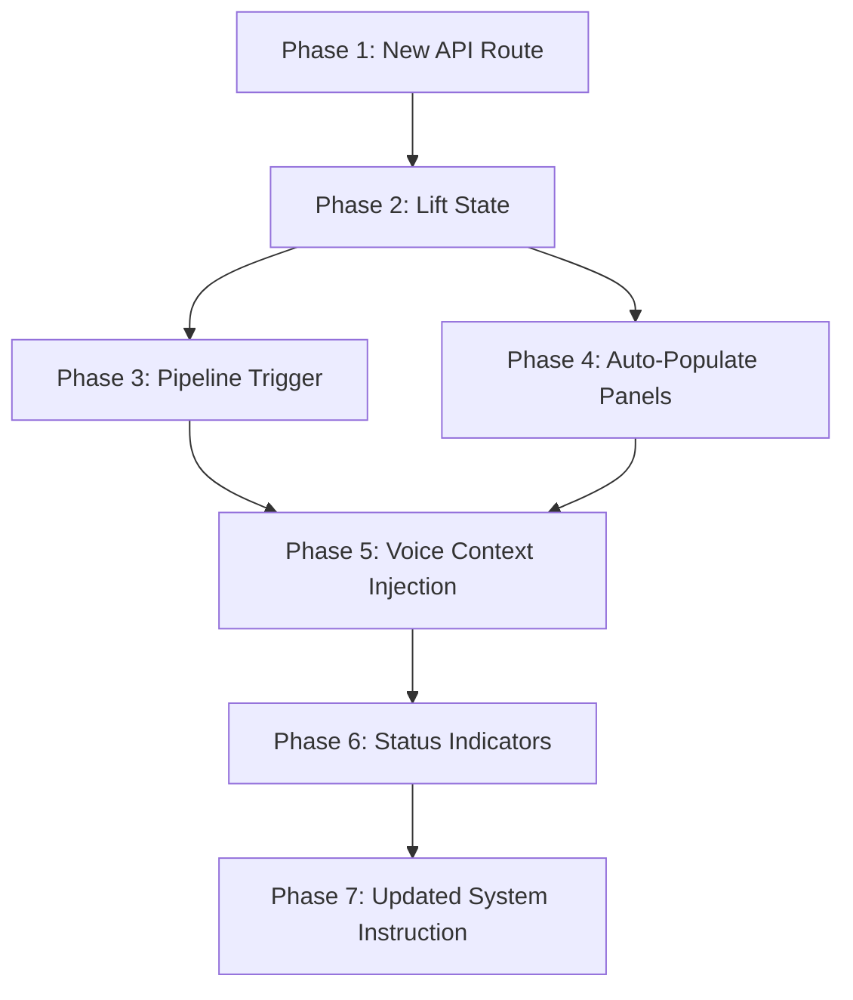

# Technical Implementation Plan: Automated Voice Analysis Pipeline

**PRD:** [PRD-005](./PRD-005-voice-analysis-pipeline.md)
**GitHub Issue:** [#5](https://github.com/ithllc/ArchIntel/issues/5)
**Date:** 2026-03-21

---

## Overview

Transform ArchIntel from three independent features into a unified pipeline where starting a voice session auto-triggers STRIDE security analysis and cost estimation concurrently, feeds structured results into the live voice conversation, and auto-populates the Security and Cost tabs.

## Architecture

```
page.tsx (state owner)
│
├── pipelineStatus: { threat: Status, cost: Status }
├── threatResults: { text, terraformFiles } | null
├── costResults: { text, breakdown } | null
├── triggerPipeline(file) → fires both API calls
│
├── VoicePanel ── calls triggerPipeline on setupComplete
│                  watches threatResults/costResults → injects via clientContent
│
├── ThreatPanel ── displays threatResults if present
│                   manual button still works (overwrites)
│
└── CostPanel ── displays costResults if present
                  manual button still works (overwrites)
```

## Dependency Graph



---

## Phase 1: Create One-Shot Cost Estimation API Route

### Objective
Create `/api/cost-estimate-auto` that accepts a diagram image via FormData and returns a complete cost analysis in one shot (no conversational back-and-forth).

### Implementation Steps

**Step 1.1** — Create `archintel/app/api/cost-estimate-auto/route.ts`

This route mirrors `/api/threat-model` in accepting FormData with a `diagram` File, but uses `generateText` (not `streamText`) since we need the complete result for voice injection.

```typescript
// Key design decisions:
// - Use generateText (not streamText) — we need the full result atomically
// - maxSteps: 5 — model identifies services, then calculates cost in one pass
// - Accept FormData with 'diagram' field (same as threat-model)
// - Return JSON with { text, breakdown, totalMonthlyCost }
// - Still save to Supabase cost_estimates table
```

**API Contract:**
```
POST /api/cost-estimate-auto
Content-Type: multipart/form-data
Body: { diagram: File }

Response 200:
{
  "text": "## Cost Analysis\n...",        // Full markdown analysis
  "breakdown": [                           // Structured cost data
    { "name": "Cloud Run", "type": "cloud-run", "monthlyCost": 12.50, ... }
  ],
  "totalMonthlyCost": 245.00,
  "annualEstimate": 2940.00
}

Response 500:
{ "error": "Cost estimation failed" }
```

**Implementation detail:** Use `generateText` with `maxSteps: 5` so the model can call `identifyServices` then `calculateCost` in sequence, then produce a final text summary. Extract the tool results from `result.steps` to build the structured `breakdown` response.

### Files
| File | Action |
|------|--------|
| `app/api/cost-estimate-auto/route.ts` | **CREATE** |

---

## Phase 2: Lift Pipeline State to page.tsx

### Objective
Add shared state to `page.tsx` so pipeline results and status are accessible to all three panels.

### Implementation Steps

**Step 2.1** — Define shared TypeScript types

Add to `page.tsx` (or a separate `lib/types.ts` if preferred, but keep it simple):

```typescript
type PipelineStatus = 'idle' | 'running' | 'complete' | 'error';

interface TerraformFile {
  filename: string;
  content: string;
  threatName: string;
  severity: string;
}

interface ThreatResults {
  text: string;
  terraformFiles: TerraformFile[];
}

interface CostBreakdownItem {
  name: string;
  type: string;
  description?: string;
  count?: number;
  computeCost?: number;
  dataCost?: number;
  monthlyCost: number;
}

interface CostResults {
  text: string;
  breakdown: CostBreakdownItem[];
  totalMonthlyCost: number;
  annualEstimate: number;
}
```

**Step 2.2** — Add state variables to `page.tsx`

```typescript
const [pipelineStatus, setPipelineStatus] = useState<{
  threat: PipelineStatus;
  cost: PipelineStatus;
}>({ threat: 'idle', cost: 'idle' });

const [threatResults, setThreatResults] = useState<ThreatResults | null>(null);
const [costResults, setCostResults] = useState<CostResults | null>(null);
```

**Step 2.3** — Create `triggerPipeline` function in `page.tsx`

This function fires both API calls concurrently using `Promise.allSettled`. Each call updates its own status independently.

```typescript
const triggerPipeline = useCallback(async (file: File) => {
  setPipelineStatus({ threat: 'running', cost: 'running' });

  const formData = new FormData();
  formData.append('diagram', file);

  // Fire both concurrently
  const [threatPromise, costPromise] = [
    // Threat analysis — stream response, collect full text + terraform files
    (async () => {
      const res = await fetch('/api/threat-model', { method: 'POST', body: formData });
      // Parse the AI SDK stream to extract text and tool calls
      // (reuse the same parsing logic from threat-panel.tsx)
      return parseThreatStream(res);
    })(),
    // Cost estimation — one-shot JSON response
    (async () => {
      const res = await fetch('/api/cost-estimate-auto', { method: 'POST', body: formData });
      return res.json();
    })(),
  ];

  // Handle threat result
  threatPromise
    .then(result => {
      setThreatResults(result);
      setPipelineStatus(prev => ({ ...prev, threat: 'complete' }));
    })
    .catch(() => {
      setPipelineStatus(prev => ({ ...prev, threat: 'error' }));
    });

  // Handle cost result
  costPromise
    .then(result => {
      setCostResults(result);
      setPipelineStatus(prev => ({ ...prev, cost: 'complete' }));
    })
    .catch(() => {
      setPipelineStatus(prev => ({ ...prev, cost: 'error' }));
    });
}, []);
```

**Step 2.4** — Extract `parseThreatStream` helper

Extract the stream parsing logic currently in `threat-panel.tsx` lines 54-122 into a shared function. This function reads the AI SDK data stream and returns `{ text: string, terraformFiles: TerraformFile[] }`.

Place in `lib/parse-threat-stream.ts`.

**Step 2.5** — Pass new props to child components

```tsx
<VoicePanel
  diagramFile={diagramFile}
  onPipelineTrigger={triggerPipeline}
  pipelineStatus={pipelineStatus}
  threatResults={threatResults}
  costResults={costResults}
/>
<ThreatPanel
  diagramFile={diagramFile}
  pipelineStatus={pipelineStatus.threat}
  pipelineResults={threatResults}
/>
<CostPanel
  diagramFile={diagramFile}
  pipelineStatus={pipelineStatus.cost}
  pipelineResults={costResults}
/>
```

### Files
| File | Action |
|------|--------|
| `app/page.tsx` | **MODIFY** — add state, triggerPipeline, pass props |
| `lib/parse-threat-stream.ts` | **CREATE** — extracted stream parser |

---

## Phase 3: Wire Pipeline Trigger to Voice Session Start

### Objective
When the Gemini Live WebSocket sends `setupComplete`, call `triggerPipeline` to fire both analyses.

### Implementation Steps

**Step 3.1** — Update `VoicePanelProps` interface

```typescript
interface VoicePanelProps {
  diagramFile: File | null;
  onPipelineTrigger?: (file: File) => void;
  pipelineStatus?: { threat: PipelineStatus; cost: PipelineStatus };
  threatResults?: ThreatResults | null;
  costResults?: CostResults | null;
}
```

**Step 3.2** — Add pipeline trigger in `setupComplete` handler

In `voice-panel.tsx`, inside the `if (msg.setupComplete)` block (currently line 170), add after `setIsConnected(true)`:

```typescript
// Trigger automated analysis pipeline
if (diagramFile && onPipelineTrigger) {
  onPipelineTrigger(diagramFile);
}
```

This fires both API calls immediately when the voice session is established, in parallel with the microphone setup and diagram upload to Gemini Live.

### Files
| File | Action |
|------|--------|
| `components/voice-panel.tsx` | **MODIFY** — new props, trigger call |

---

## Phase 4: Auto-Populate Security and Cost Panels

### Objective
When pipeline results arrive, display them in their respective tabs without requiring manual button clicks.

### Implementation Steps

**Step 4.1** — Update `ThreatPanel` to accept pipeline results

Add `pipelineStatus` and `pipelineResults` to `ThreatPanelProps`. When `pipelineResults` is not null:
- Set `streamedText` from `pipelineResults.text`
- Set `terraformFiles` from `pipelineResults.terraformFiles`
- Show results immediately (no manual click needed)

Use a `useEffect` that watches `pipelineResults`:

```typescript
useEffect(() => {
  if (pipelineResults) {
    setStreamedText(pipelineResults.text);
    setTerraformFiles(pipelineResults.terraformFiles);
  }
}, [pipelineResults]);
```

Keep the manual "Run Analysis" button — when clicked, it overwrites pipeline results with a fresh analysis.

**Step 4.2** — Update `CostPanel` to accept pipeline results

Add `pipelineStatus` and `pipelineResults` to `CostPanelProps`. When `pipelineResults` is not null:
- Display cost results in a static card (not the conversational `useChat` interface)
- Show the markdown text analysis and cost breakdown table
- The conversational chat interface activates only if the user clicks "Estimate Costs" manually or starts typing

Use a `useEffect` to set a `pipelineData` display state:

```typescript
const [pipelineData, setPipelineData] = useState<CostResults | null>(null);

useEffect(() => {
  if (pipelineResults) {
    setPipelineData(pipelineResults);
  }
}, [pipelineResults]);
```

Render `pipelineData` above the conversational area if present.

**Step 4.3** — Ensure manual buttons still work

Both panels must allow the user to click their manual analysis buttons at any time. Manual analysis overwrites pipeline results. The panels should show which mode produced the current results (badge: "Auto-analyzed" vs. manual).

### Files
| File | Action |
|------|--------|
| `components/threat-panel.tsx` | **MODIFY** — accept/display pipeline results |
| `components/cost-panel.tsx` | **MODIFY** — accept/display pipeline results |

---

## Phase 5: Voice Context Injection

### Objective
When ThreatOps or CostSight results arrive during an active voice session, inject structured summaries into the Gemini Live conversation via `clientContent.turns`.

### Implementation Steps

**Step 5.1** — Create summary formatters

Create `lib/format-voice-context.ts` with two functions:

```typescript
export function formatThreatSummaryForVoice(results: ThreatResults): string {
  // Extract key findings from the markdown text
  // Include: top 3 threats with severity, remediation headlines, terraform file count
  // Keep under 1500 chars (roughly 400 tokens)
  return `[SECURITY ANALYSIS COMPLETE]
Here are the key findings from the STRIDE threat analysis:

${extractTopThreats(results.text)}

${results.terraformFiles.length} Terraform remediation policies have been generated:
${results.terraformFiles.map(tf => `- ${tf.filename}: ${tf.threatName} (${tf.severity})`).join('\n')}

You can now answer the user's questions about these specific security findings.`;
}

export function formatCostSummaryForVoice(results: CostResults): string {
  // Include: total monthly/annual cost, top 3 cost items, optimization hints
  // Keep under 1500 chars
  return `[COST ANALYSIS COMPLETE]
Here are the key findings from the cost estimation:

Total Monthly Cost: $${results.totalMonthlyCost}
Annual Estimate: $${results.annualEstimate}

Service Breakdown:
${results.breakdown.map(s => `- ${s.name}: $${s.monthlyCost}/month`).join('\n')}

You can now answer the user's questions about these specific cost findings.`;
}
```

**Step 5.2** — Add `useEffect` watchers in VoicePanel for result injection

In `voice-panel.tsx`, add two `useEffect` hooks that watch `threatResults` and `costResults`:

```typescript
useEffect(() => {
  if (threatResults && wsRef.current?.readyState === WebSocket.OPEN) {
    const summary = formatThreatSummaryForVoice(threatResults);
    wsRef.current.send(JSON.stringify({
      clientContent: {
        turns: [{
          role: 'user',
          parts: [{ text: summary }]
        }],
        turnComplete: true
      }
    }));
  }
}, [threatResults]);

useEffect(() => {
  if (costResults && wsRef.current?.readyState === WebSocket.OPEN) {
    const summary = formatCostSummaryForVoice(costResults);
    wsRef.current.send(JSON.stringify({
      clientContent: {
        turns: [{
          role: 'user',
          parts: [{ text: summary }]
        }],
        turnComplete: true
      }
    }));
  }
}, [costResults]);
```

**Important:** These injections are sent as `clientContent` (text), not audio. Gemini Live will incorporate them into its context and can reference the data in subsequent voice responses.

### Files
| File | Action |
|------|--------|
| `lib/format-voice-context.ts` | **CREATE** — summary formatters |
| `components/voice-panel.tsx` | **MODIFY** — add useEffect injection hooks |

---

## Phase 6: Pipeline Status Indicators

### Objective
Show analysis progress in the tab bar and within each panel.

### Implementation Steps

**Step 6.1** — Add status badges to tab triggers in `page.tsx`

Modify the `TabsTrigger` components to show status indicators:

```tsx
<TabsTrigger value="threats" className="...">
  <Shield className="h-4 w-4" />
  Security
  {pipelineStatus.threat === 'running' && (
    <Loader2 className="h-3 w-3 animate-spin text-red-400" />
  )}
  {pipelineStatus.threat === 'complete' && (
    <Check className="h-3 w-3 text-green-400" />
  )}
  {pipelineStatus.threat === 'error' && (
    <AlertTriangle className="h-3 w-3 text-yellow-400" />
  )}
</TabsTrigger>
```

Same pattern for Costs tab with `pipelineStatus.cost`.

**Step 6.2** — Add pipeline status bar to VoicePanel

Below the voice controls, show a compact status bar when the pipeline is active:

```tsx
{(pipelineStatus?.threat === 'running' || pipelineStatus?.cost === 'running') && (
  <Card className="p-3 bg-card/50 border-border">
    <div className="flex items-center gap-4 text-xs">
      <span className="text-muted-foreground">Auto-analyzing:</span>
      <StatusPill label="Security" status={pipelineStatus.threat} />
      <StatusPill label="Costs" status={pipelineStatus.cost} />
    </div>
  </Card>
)}
```

**Step 6.3** — Add "Auto-analyzed" badge to ThreatPanel and CostPanel

When results came from the pipeline (not manual), show a small badge:

```tsx
{pipelineResults && !isAnalyzing && (
  <Badge className="bg-purple-900/30 text-purple-400 border-purple-700 text-xs">
    Auto-analyzed via Voice
  </Badge>
)}
```

### Files
| File | Action |
|------|--------|
| `app/page.tsx` | **MODIFY** — tab status badges |
| `components/voice-panel.tsx` | **MODIFY** — pipeline status bar |
| `components/threat-panel.tsx` | **MODIFY** — auto-analyzed badge |
| `components/cost-panel.tsx` | **MODIFY** — auto-analyzed badge |

---

## Phase 7: Update Voice System Instruction

### Objective
Update the Gemini Live system instruction to tell the model it will receive structured analysis data and should use it to answer specific questions.

### Implementation Steps

**Step 7.1** — Update system instruction in `voice-panel.tsx`

Replace the current system instruction (lines 150-159) with:

```typescript
text: `You are ArchIntel, an expert architecture intelligence assistant. You analyze architecture diagrams for security threats (using STRIDE methodology) and cloud cost estimation.

When the user shows you a diagram or asks about their architecture:
1. Describe what you see in the diagram
2. Give a brief initial security and cost overview based on what you see

IMPORTANT: You will receive structured analysis data marked with [SECURITY ANALYSIS COMPLETE] and [COST ANALYSIS COMPLETE] during the conversation. When you receive this data:
- Use it to answer specific questions about threats, costs, and remediations
- Reference specific threat names, severities, and Terraform filenames from the data
- Reference specific cost figures and service breakdowns from the data
- When asked about Terraform, refer the user to the Security tab where files are displayed

Be concise but thorough. Speak naturally. Keep responses under 30 seconds of speech.
When citing specific numbers or findings, say "according to our analysis" to indicate the data is from the automated pipeline.`
```

### Files
| File | Action |
|------|--------|
| `components/voice-panel.tsx` | **MODIFY** — update system instruction |

---

## Complete File Manifest

| File | Phase | Action | Description |
|------|-------|--------|-------------|
| `app/api/cost-estimate-auto/route.ts` | 1 | CREATE | One-shot cost estimation endpoint |
| `lib/parse-threat-stream.ts` | 2 | CREATE | Shared AI SDK stream parser |
| `lib/format-voice-context.ts` | 5 | CREATE | Voice context summary formatters |
| `app/page.tsx` | 2, 6 | MODIFY | Lifted state, pipeline function, tab badges |
| `components/voice-panel.tsx` | 3, 5, 6, 7 | MODIFY | Pipeline trigger, context injection, status, system prompt |
| `components/threat-panel.tsx` | 4, 6 | MODIFY | Accept pipeline results, auto-analyzed badge |
| `components/cost-panel.tsx` | 4, 6 | MODIFY | Accept pipeline results, auto-analyzed badge |

---

## Risk Assessment

| Risk | Impact | Mitigation |
|------|--------|------------|
| Gemini Live context overflow from large injections | Voice stops responding coherently | Cap summaries at 1500 chars each; use `extractTopThreats` to trim |
| Both API calls + WebSocket exceed Gemini rate limits | 429 errors on cost or threat endpoint | Use separate Gemini API calls (not same session); handle 429 with retry + error status |
| Cost one-shot analysis less accurate without user input | Missing traffic/scale context | Use generous default assumptions (730 hrs/month, 100GB); note "estimates based on default assumptions" |
| Stream parsing differences between pipeline and manual flows | ThreatPanel shows different results | Use shared `parseThreatStream` for both paths |
| Voice context injection timing (injecting while model is speaking) | Interrupts or confuses current response | Wait for `turnComplete` before injecting; queue injections |

---

## Success Criteria

- [ ] Starting voice session auto-triggers both analyses with no additional clicks
- [ ] Security tab shows STRIDE analysis + Terraform files from pipeline
- [ ] Costs tab shows cost breakdown from pipeline
- [ ] Voice can answer "What's the most critical threat?" with actual STRIDE data
- [ ] Voice can answer "How much will this cost?" with actual cost figures
- [ ] Manual buttons still work independently
- [ ] Pipeline errors are isolated (one failure doesn't block others)
- [ ] Tab status indicators show running/complete/error states
- [ ] Both analyses complete within 20 seconds of voice session start
